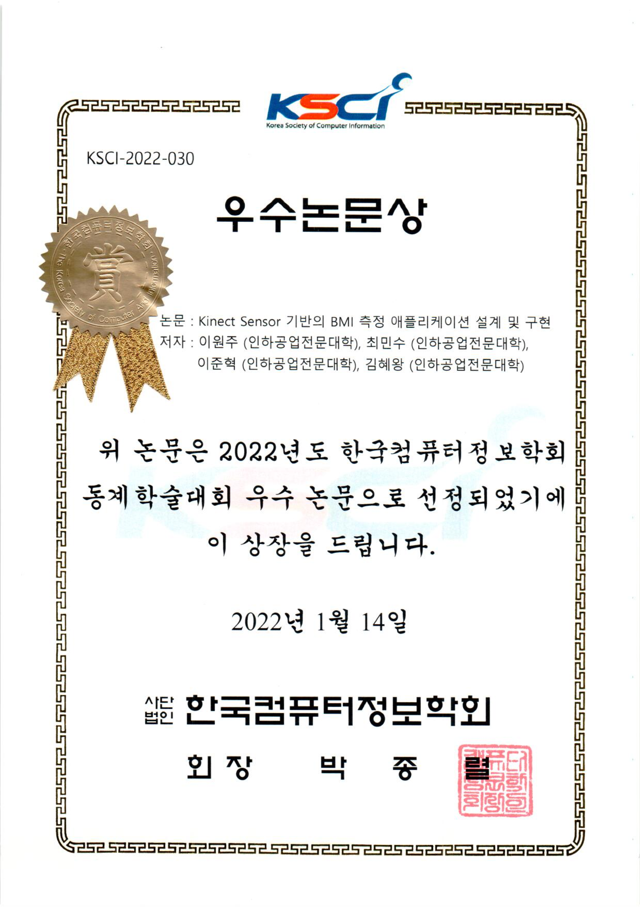

  <h1>Physical Check-up BMI measurement 
  <h1>Application Based on Kinect Sensor

  <h2>2021-2학기 / 2학년 SW프로젝트  

  
  
---
    
## Introduce
    
  
  먼저 프로젝트 선정에 있어서 우리는 공익성이나 수익성이 유효한가? 를 먼저 생각하였고,    
  그러면서도 우리들의 능력 내에서 구현 가능한 기능을 사용하고자 하였다.
    
  키넥트의 픽셀 정보 기능을 활용해 사용자의 거리정보를 포함하여 인식된 내용과 거리를 응용해 체중을 계산하는 기능을 구현하고,
  사용자의 20개의 관절 정보를 얻어 추적된 골격 정보로 키를 계산해서,
  BMI 측정을 진행하고자 했다.
  
  또, 코로나 사태가 지속되면서 사람들이 전염병에 대한 위험인식이 강화되었다. 이로 인해 시간이 지날수록 사람들은 굳이 필요하지 않은 사람간의 접촉을 꺼리게 되지 않을까 라고 생각하였다.
  
  
  

  
- 키넥트란?
  - 키넥트(Kinect) 센서는 3개의 카메라와 마이크가 내장되어 있어 사용자의 동작과 음성을 인식할 수 있다
  - 최근 게임 컨트롤 도구인 키넥트(Kinect) 센서를 컴퓨터와 연동하여 교육, 의료, 건강, 게임 등 다양한 분야에 응용하고 있다.
  - 키넥트 센서의 뎁스스트림과 스켈레톤을 기반으로 사용자의 BMI측정을 위한 어플리케이션을 설계하고 구현하였다.

  
# Why?
 
- 선정기준
  - 강의시간에 학습하고 발표 했었던 부분의 기능을 활용하고자 함.
  - 기말고사까지 기간 내에 완성 가능한 범위에서 만들고자 함.
  - 프로젝트의 기능 자체에 공익성이나 수익성이 유효하다고 판단함.
  - 사용하고자 하는 키넥트의 한계 조건 범위내에 부합함.

  
  
- 선정배경
  - 병역 의무자는 무조건 최소 한 번은 신체검사를 받게 된다.
  - 병역판정검사에 소요되는 시간은 적지 않고, 그에 필요한 근무 인원 또한 앞으로의 신체검사에 있어 큰 부담으로 다가올 것이기 때문에 이러한 문제를 해결할 다양한 노력이 필요하고 생각하였다.
  - 이에 따른 기대 효과로 현재 적용하고자 하는 병역신체검사뿐 아니라 다양한 의료환경에서 쓰일 수 있다고 생각한다.

# 
  
  

  
### Software development environment. 

  
  Visual Studio 2017 .NET WinForms for C#
  
  Kinect for Windows SDK 2.0
  
  Oracle
  
# Prize

